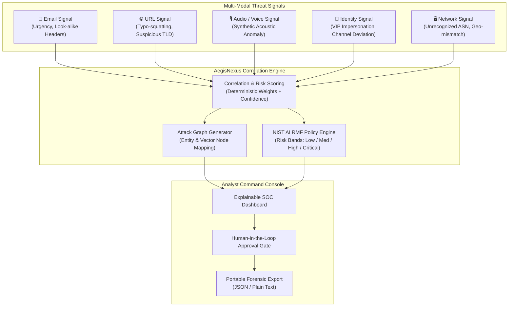

# AegisNexus 🛡️

[](https://opensource.org/licenses/MIT)
[](https://react.dev/)
[](https://www.typescriptlang.org/)
[](https://vitejs.dev/)
[](https://tailwindcss.com/)
[](https://github.com/sahilshaikh1101/AegisNexus)

> **Explainable cross-modal defense console against coordinated communication fraud.**  
> Correlates email, URL, identity, audio, and network evidence into a unified, explainable incident view with human-in-the-loop response approval.

---

## 🚀 Hackathon Demonstration & Evaluator Quick Access

| Resource | Details |
|---|---|
| **Live POC URL** | [https://3000-irkkmj4d0310bmuk20ljm-85fdd0df.sg2.manus.computer](https://3000-irkkmj4d0310bmuk20ljm-85fdd0df.sg2.manus.computer) |
| **Demo Analyst Email** | `analyst@aegisnexus.com` |
| **Demo Password** | `demo123` |
| **Evaluation Date** | 16 September 2026 |

> [!TIP]
> **2-Minute Evaluator Tour:**
> 1. Sign in with the demo credentials above.
> 2. Select the **CFO Impersonation** incident (`INC-2026-0916-001`) — inspect the 5 correlated signals (email urgency, look-alike domain, cloned voice note, VIP identity spoofing, external ASN).
> 3. Click **Attack Graph** to visualize evidence relationships and multi-vector clustering.
> 4. Inspect **Policies** to see how risk thresholds map to recommended response actions.
> 5. Click **Record Incident** to create a custom incident with live URL/email/audio signal attachments.
> 6. Click **Export Incident** to download structured `.json` or human-readable `.txt` incident briefs.

---

## 🎯 Problem Statement & Significance

Modern cyber fraud has evolved beyond simple phishing into **coordinated, multi-channel attacks** combining spearphishing emails, look-alike domains, voice deepfakes, and identity spoofing:

- **The Scale:** According to the **FBI IC3 2024 Report**, exposed Business Email Compromise (BEC) losses surpassed **$55.4 Billion** globally.
- **The Operational Challenge:** Traditional Security Operations Centers (SOCs) receive fragmented, disconnected alerts. Analysts struggle to connect a voice note anomaly with a suspicious domain registration and an urgent payment email.
- **The Core Questions AegisNexus Answers:**
  1. *What happened across communication channels?*
  2. *Why is it risky and what is the business impact?*
  3. *What evidence and attack-graph relationships substantiate the threat?*
  4. *What safe, human-approved mitigation should be triggered?*

---

## 🏛️ Architecture & Cross-Modal Signal Flow

AegisNexus correlates multi-modal signals using deterministic risk scoring, confidence weighting, and explainable attack graphs:



---

## ✨ Key Capabilities

| Capability | Description | Status in POC |
|---|---|---|
| **Cross-Modal Ingestion** | Ingests and correlates Email, URL, Voice Note, Identity, and Network signals into one unified incident timeline. | ✅ Fully Interactive |
| **Interactive Attack Graph** | Node-and-link topological visualization of threat relationships, entity associations, and risk contributors. | ✅ Implemented (SVG Canvas) |
| **Explainable Risk Scoring** | Transparent 0–100 risk score with confidence intervals and exact formula breakdowns — no black-box decisions. | ✅ Implemented |
| **Human-in-the-Loop Response** | High-impact containment actions (isolate account, hold payment, block domain) require explicit analyst confirmation. | ✅ Implemented with Audit Log |
| **Incident Recording & Attachments** | Manual incident entry with support for attaching URLs, `.eml`/`.msg` raw files, and audio recordings. | ✅ Implemented (Browser Persistence) |
| **Search & Filtering** | Instant search across incident names, summaries, risk bands, and impacted entities. | ✅ Implemented |
| **Forensic Export** | One-click export to structured `.json` or analyst-formatted `.txt` for SIEM/SOAR handoff. | ✅ Implemented |
| **Enterprise Connectors** | Live connectors to Microsoft Graph, Google Workspace, Okta, and enterprise SIEM platforms. | 📋 Roadmap / Planned |

---

## 💻 Local Setup & Quick Start

### Prerequisites
- **Node.js**: `v18.0.0` or later (tested on `v22.x`)
- **Package Manager**: `pnpm` (recommended) or standard `npm`

### Option 1: Using `pnpm` (Recommended)

```bash
# Clone the repository
git clone https://github.com/sahilshaikh1101/AegisNexus.git
cd AegisNexus

# Install dependencies
pnpm install

# Start development server
pnpm dev
```

### Option 2: Using `npm`

```bash
# Clone the repository
git clone https://github.com/sahilshaikh1101/AegisNexus.git
cd AegisNexus

# Install dependencies
npm install

# Start development server
npm run dev
```

Open your browser at `http://localhost:3000` (or the port displayed in your terminal).

### Validation & Build Commands

```bash
# Type check TypeScript codebase
npm run check
# or
pnpm check

# Production bundle build
npm run build
# or
pnpm build
```

---

## 📚 Research & Standards Backing

AegisNexus is grounded in established cybersecurity standards and federal guidance:

1. **FBI Business Email Compromise Guidance**  
   Adheres to FBI guidance on domain verification, out-of-band communication, and holding high-value payment requests pending secondary authentication.  
   *Reference:* [FBI Common Frauds & Scams — BEC](https://www.fbi.gov/how-we-can-help-you/common-frauds-and-scams/business-email-compromise) | [IC3 $55.4B PSA](https://www.ic3.gov/PSA/2024/PSA240911)

2. **NIST AI Risk Management Framework (AI RMF 1.0)**  
   Implements core NIST AI RMF characteristics: **Validity, Reliability, Explainability, Transparency, and Human Agency**. Decisions provide visible evidence rationale rather than unexplainable automated blocks.  
   *Reference:* [NIST AI RMF](https://www.nist.gov/itl/ai-risk-management-framework)

3. **CISA & NSA Phishing Defense Guidance**  
   Applies secure-by-default and defense-in-depth principles for stopping phishing attack cycles at Phase One.  
   *Reference:* [CISA Phishing Guidance](https://www.cisa.gov/resources-tools/resources/phishing-guidance-stopping-attack-cycle-phase-one)

---

## 📁 Repository Structure

```
AegisNexus/
├── client/                     # Frontend Application (React 19 + TypeScript + Vite)
│   ├── public/                 # Static assets
│   ├── src/
│   │   ├── components/         # Radix UI primitives & custom components (Map, Dialogs)
│   │   ├── contexts/           # Theme and state management
│   │   ├── hooks/              # Custom React hooks (mobile, composition, persist)
│   │   ├── lib/                # Incident models, scoring algorithms, utility helpers
│   │   ├── pages/              # Primary views: Home (SOC Console), Login, NotFound
│   │   ├── index.css           # Mission-control Brutalism design tokens
│   │   └── main.tsx            # App entry point
│   └── index.html              # HTML shell with Google Fonts
├── presentation/               # Interactive evaluation presentation deck (HTML slides)
├── server/                     # Backend API & SSR entry point
├── shared/                     # Shared constants and contracts
├── AegisNexus_Evaluation_Package.md   # Comprehensive hackathon evaluation document
├── AegisNexus_Hackathon_Presentation.md # Presentation outline and slide notes
├── AegisNexus_Presenter_Script.md     # Spoken evaluation walkthrough script
├── AegisNexus_Submission_Checklist.md # Requirements and readiness checklist
├── AegisNexus_demo_guide.md           # Step-by-step evaluator demo guide
├── package.json
├── tsconfig.json
└── vite.config.ts
```

---

## 📋 Evaluation Package Documents

For evaluators and judges reviewing the project:
- 📖 [AegisNexus Evaluation Package](AegisNexus_Evaluation_Package.md) — Problem statement, research basis, requirement mapping, and feasibility.
- 🗣️ [Presenter Script](AegisNexus_Presenter_Script.md) — Full spoken script matching the demo flow.
- 📊 [Hackathon Presentation Outline](AegisNexus_Hackathon_Presentation.md) — 11-slide presentation overview.
- 🧪 [Demo Guide](AegisNexus_demo_guide.md) — Step-by-step testing instructions for all 3 demo scenarios.
- ✅ [Submission Checklist](AegisNexus_Submission_Checklist.md) — Requirement-to-evidence checklist.

---

## 👥 Team & Submission Information

- **Project Name:** AegisNexus
- **Category:** Cybersecurity / AI Fraud Defense / Incident Response
- **Live POC:** [https://3000-irkkmj4d0310bmuk20ljm-85fdd0df.sg2.manus.computer](https://3000-irkkmj4d0310bmuk20ljm-85fdd0df.sg2.manus.computer)
- **GitHub:** [https://github.com/sahilshaikh1101/AegisNexus](https://github.com/sahilshaikh1101/AegisNexus)
- **License:** [MIT License](LICENSE)
